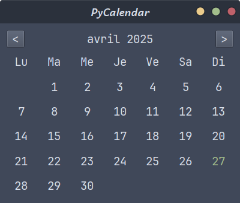

# PyCalendar


<div align="center">
  
</div>

## Présentation
Simple interface graphique qui affiche le calendrier du mois en cours (la date du jour est affichée en vert). Deux boutons permettent de naviguer entre mois précédent ou mois suivant.

## Dépendances
libxcb-cursor0 est une bibliothèque essentielle pour la gestion des curseurs dans les applications graphiques sous Linux, faisant partie intégrante du système X Window et de l'écosystème XCB. Si libxcb-cursor0 est manquante, vous pouvez rencontrer des erreurs lors de l'exécution d'applications graphiques, notamment des erreurs liées à l'impossibilité de charger les plugins de plateforme Qt :
```bash
sudo apt-get install libxcb-cursor0
```
---
# English translation
## Presentation
Simple graphical interface displaying the current month's calendar (today's date is shown in green). Two buttons allow navigation between previous and next month.

## Dependencies
libxcb-cursor0 is an essential library for cursor management in graphical applications on Linux, and is an integral part of the X Window System and the XCB ecosystem. If libxcb-cursor0 is missing, you may encounter errors when running graphical applications, including errors related to the inability to load Qt platform plugins:
```bash
sudo apt-get install libxcb-cursor0
```


